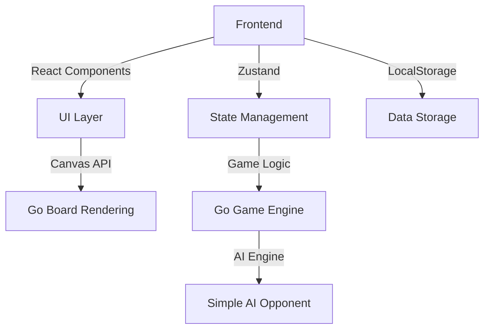

## 1. Architecture Design


## 2. Technology Description
- **Frontend**: React@18 + TypeScript + Tailwind CSS@3 + Vite
- **Initialization Tool**: vite-init
- **State Management**: Zustand
- **Data Storage**: LocalStorage（存储游戏进度和关卡数据）
- **UI Framework**: Tailwind CSS
- **Board Rendering**: Canvas API

## 3. Route Definitions
| Route | Purpose |
|-------|---------|
| / | 首页（关卡选择页面） |
| /play/:level | 对弈练习页面 |
| /stats | 进度统计页面 |

## 4. Data Model
### 4.1 Level Data Structure
```typescript
interface Level {
  id: number;
  name: string; // "25级", "24级", ..., "1段", ..., "5段"
  difficulty: number; // AI难度等级
  requiredWins: number; // 需要胜利次数解锁下一关
  unlocked: boolean;
  completed: boolean;
  wins: number;
  totalGames: number;
  stars: number; // 0-3星评分
}

interface GameState {
  board: (0 | 1 | 2)[][]; // 0: empty, 1: black, 2: white
  currentPlayer: 1 | 2;
  captures: { black: number; white: number };
  history: (0 | 1 | 2)[][][]; // 历史棋盘状态
  level: Level;
}

interface UserProgress {
  currentLevel: number;
  levels: Level[];
  totalWins: number;
  totalGames: number;
}
```

### 4.2 Initial Data
```typescript
// 初始化关卡数据
const initializeLevels = (): Level[] => {
  const levels: Level[] = [];
  // 25级到1段
  for (let i = 25; i &gt;= 1; i--) {
    levels.push({
      id: 26 - i,
      name: `${i}级`,
      difficulty: 26 - i,
      requiredWins: 3,
      unlocked: i === 25,
      completed: false,
      wins: 0,
      totalGames: 0,
      stars: 0
    });
  }
  // 1段到5段
  for (let i = 1; i &lt;= 5; i++) {
    levels.push({
      id: 25 + i,
      name: `${i}段`,
      difficulty: 25 + i,
      requiredWins: 5,
      unlocked: false,
      completed: false,
      wins: 0,
      totalGames: 0,
      stars: 0
    });
  }
  return levels;
};
```

## 5. Component Structure
```
src/
├── components/
│   ├── GoBoard.tsx        # 围棋棋盘组件
│   ├── LevelCard.tsx      # 关卡卡片组件
│   ├── GameControls.tsx   # 游戏控制组件
│   ├── ProgressBar.tsx    # 进度条组件
│   └── StatsCard.tsx      # 统计卡片组件
├── pages/
│   ├── Home.tsx           # 首页
│   ├── Play.tsx           # 对弈练习页
│   └── Stats.tsx          # 进度统计页
├── hooks/
│   ├── useGoGame.ts       # 围棋游戏逻辑Hook
│   └── useAI.ts           # AI对手Hook
├── store/
│   └── useGameStore.ts    # Zustand状态管理
├── utils/
│   ├── goLogic.ts         # 围棋规则逻辑
│   └── aiEngine.ts        # AI引擎
├── types/
│   └── index.ts           # TypeScript类型定义
└── App.tsx                # 主应用组件
```
