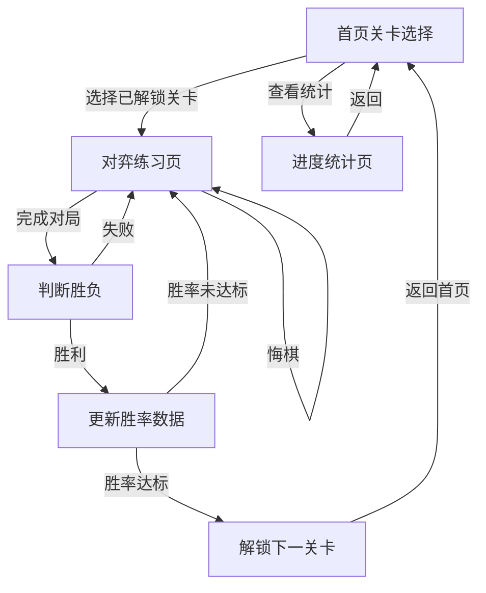

## 1. Product Overview
围棋对弈练习网页程序，面向儿童用户，提供从25级到业余5段的分级闯关练习。通过轻松活泼的界面设计和闯关模式，激发儿童学习围棋的兴趣，帮助用户逐步提升围棋水平。

## 2. Core Features

### 2.1 Feature Module
1. **首页（关卡选择）**：展示所有可解锁的关卡，显示当前进度和胜率
2. **对弈练习页**：交互式围棋棋盘，与AI对弈，实时显示胜负
3. **进度统计页**：查看各关卡的胜率、完成情况

### 2.3 Page Details
| Page Name | Module Name | Feature description |
|-----------|-------------|---------------------|
| 首页 | 关卡展示 | 以图标形式展示25级到业余5段的所有关卡，显示已解锁、已通关、未解锁状态 |
| 首页 | 进度条 | 显示整体关卡进度和当前等级 |
| 首页 | 统计卡片 | 显示总胜场数、总场次、胜率等关键数据 |
| 对弈练习页 | 围棋棋盘 | 19x19标准棋盘，支持落子、吃子、悔棋等操作 |
| 对弈练习页 | AI对手 | 根据关卡难度调整AI水平 |
| 对弈练习页 | 游戏控制 | 开始新游戏、悔棋、认输等功能 |
| 对弈练习页 | 状态显示 | 显示当前回合、提子数、剩余时间（可选） |
| 进度统计页 | 关卡详细信息 | 查看每个关卡的对战记录、胜率、解锁条件 |

## 3. Core Process
用户首先进入首页查看可解锁的关卡，选择一个已解锁的关卡开始挑战。在对弈练习页与AI进行对弈，胜利后根据胜率判断是否解锁下一关卡。用户可以随时查看进度统计，了解自己的学习情况。

## 4. User Interface Design
### 4.1 Design Style
- **主色调**：明快温暖的橙色系（#FF9800）搭配清爽的蓝色系（#42A5F5）
- **辅助色**：活泼的黄绿渐变（#8BC34A 到 #CDDC39）
- **按钮风格**：圆润饱满的3D按钮，带有悬停和点击动画效果
- **字体**：圆润可爱的儿童字体，主要使用Poppins和Noto Sans SC
- **布局风格**：卡片式布局，圆角设计，色彩丰富
- **图标风格**：可爱的围棋相关图标，带有emoji元素

### 4.2 Page Design Overview
| Page Name | Module Name | UI Elements |
|-----------|-------------|-------------|
| 首页 | 关卡展示 | 彩色卡片，每个关卡有独特的颜色和图标，显示星星评分 |
| 首页 | 进度条 | 彩色渐变进度条，带有趣味装饰 |
| 首页 | 统计卡片 | 彩色背景卡片，显示关键数据，带有小图标 |
| 对弈练习页 | 围棋棋盘 | 木纹质感棋盘，黑白棋子有立体感，落子动画效果 |
| 对弈练习页 | 游戏控制 | 彩色按钮，排列在棋盘周围 |
| 对弈练习页 | 状态显示 | 彩色标签，直观显示当前状态 |
| 进度统计页 | 关卡信息 | 详细卡片，展示历史记录和统计图表 |

### 4.3 Responsiveness
采用移动端优先的响应式设计，在各种设备上都能提供良好的体验，尤其优化触摸操作，适合儿童使用。
